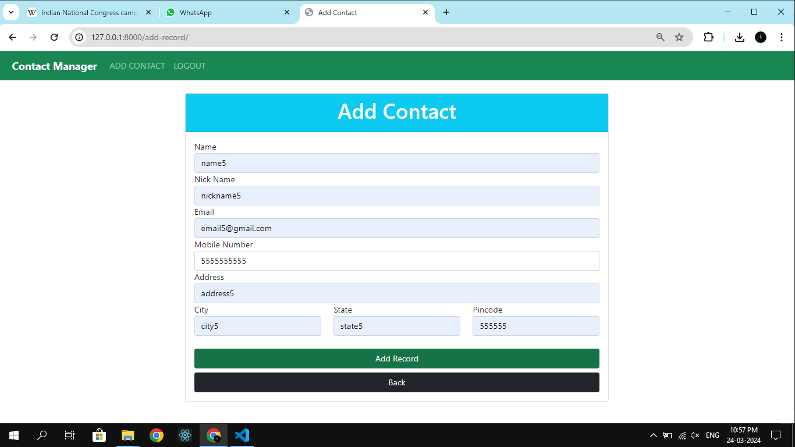

# Django Contact Manager

This is a Contact Manager project built using Django framework in Python. It allows users to sign up, log in, add contacts, update existing contacts, and delete contacts. Bootstrap is used for styling purposes.

## Features

- User authentication (signup, login, logout)
- Add new contacts with details such as name, nickname, email, mobile number, address, city, state, and pincode
- View details of individual contacts
- Update existing contact details
- Delete contacts from the list

## Installation

1. Clone the repository:

```bash
git clone https://github.com/IAmApurrv/Django-Contact-Manager.git
```

2. Install the required dependencies:

```bash
pip install -r requirements.txt
```

3. Run the Django server:

```bash
python manage.py runserver
```

4. Visit `http://127.0.0.1:8000` in your web browser to access the application.

## Usage

- Navigate to the home page to get started.
- If you're a new user, register an account.
- Log in using your credentials.
- Add, update, or delete contacts as needed.
- Log out when you're finished.

## Screenshots


*Register*


*Login*


*Showing Contacts*


*Add Contact*


*Showing Contacts Again*


*Update Contact*


*Updated Contact*


*Deleted Contact*


*Contact Card*
